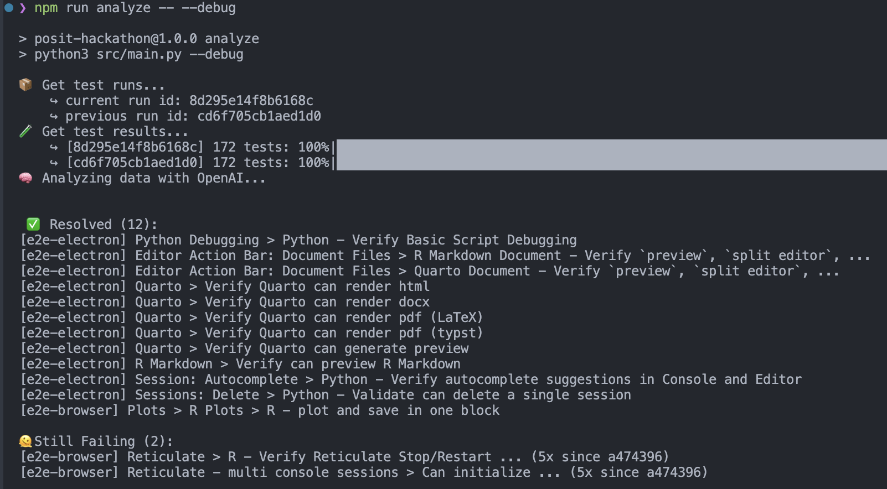

# posit-hackathon

## Purpose

This project is designed to help you retrieve, analyze, and compare test results across multiple runs using the Currents.dev API. It provides actionable insights based on the success, failure, and resolution of tests over time. Specifically, it focuses on categorizing tests into the following groups:

- **New Failures**: Tests that failed for the first time in the current run.
- **Still Failing**: Tests that have failed in both the previous and current runs.
- **Resolved**: Tests that were previously failing but have passed in the current run.
- **New Tests**: Tests that were added in the current run.

## Installation

1. Clone and install dependencies

   ```bash
   # clone the repo
   git clone https://github.com/midleman/posit-hackathon.git
   
   # ensure you have `python` and `pip` installed. Then, install the necessary dependencies by running:
   pip install -r requirements.txt
   ```

2. Add `.env` to root dir

   ```text
   CURRENTS_API_KEY=your_api_key <--- ask Marie for one if you need one!
   OPENAI_API_KEY=your_api_key
   CURRENTS_PROJECT_ID=ZOs5z2
   FILTER_BRANCHES=main,ref/heads/main
   FILTER_TAGS=merge
   ```

3. Modify `main.py` to choose sample test run id

4. Run the code!
   ```
   npm run analyze -- --debug
   ```

## Expected Output

```markdown
🫠 Still Failing (1)
[e2e-electron] New UV Environment > Python - Add new UV environment (3x since abc1234)

🔴 New Failure (1)
[e2e-electron] Notebooks > Python Notebooks > Python - Save untitled notebook and preserve... — Timeout waiting for invisibility

⭐️ New Tests (3):
[e2e-browser] Console Pane: R > R - Verify cat ... (added by Marie Idleman)
[e2e-windows] Console Pane: R > R - Verify cat ... (added by Marie Idleman)
[e2e-electron] Console Pane: R > R - Verify cat ... (added by Marie Idleman)

✅ Resolved (1):
[Interpreter: Excludes] R - Can Exclude an Interpreter
```

## Screenshot



## License

This project is licensed under the [MIT License](LICENSE).

